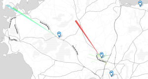

# Bilan moral

## Respect des statuts 1/2
* Fablab (référence MIT) : [AAAB](http://wiki.fablab.is/wiki/Fab_Lab_conformity_rating)
 * ouverture à tous 😊
 * charte des fablab 😊
 * participation à la communauté 😐
* Ré-appropriation technique 😊
 * diffusion de matériel
Note: manque d’interaction avec les autres fablabs
Quand même efforts pour fablabs territoire
 😂 😊 😐 😞

## Respect des statuts 2/2
* 3R : Réduire, Réutiliser, Recycler 😊
 * récupération en déchetterie / entreprises / organismes
* Promotion du logiciel et matériel Libre 😊
 * utilisation quasi-exclusive de logiciels libres
 * Libre en Fête 2018
Note: 3R merci Tom, Yannick, jeunes ML

## Objectifs 2018 1/4
### Plus de créneaux !
* Formation Fab Managers 😊
* Plus de Fab Managers 😊
* Meilleure gestion/communication des formations (inscription à l'avance) 😐
Note:
créneau du vendredi aprem

## Objectifs 2018 2/4
### Fablab 2018
* Maison des entreprises (ou autre) 😐
* Diversification des sources de financement
 * Subvention région/CG22/LTC finalisé! ... 😊
 * Ventes (Bornes, Trender, **OORobot** ...) 😂
 * Reconditionnement PC (Quid objèterie ?)
* Plus d'ouverture vers les entreprises 😐
Note: bornes: location+vente

## Objectifs 2018 3/4
### Machines
* Pas de nouvelle machine en 2018

### Événements
* Fête de la science, Forum des assos, **Libre en fête**, OpenSpaceMaker 😊
* Adonnantes, portes ouvertes 😞

## Objectifs 2018 4/4
### Compagnons numériques
* ~ 2 sessions déroulées
* 4+4 jeunes formés
* reprise d'études pour la moitié !
* prochaine session en février

😂

## Association
* Création de [contenus pédagogique](http://wiki.fablab-lannion.org/index.php?title=Cat%C3%A9gorie:Formation)
* Fin du 1er plan quinquennal d’équipement 😊
 * Locaux "pleins" 😐
* Ouverture toute l'année à 18h le Mercredi et 12h30-17h le Vendredi
 * Étalement de la communauté 😐
 * Diversification des profils et usages du lieu 😊
* Augmentation des interactions avec le territoire 😊
 * Lycée, Amis des Orgues, [OSM](https://www.federation-openspacemakers.com/fr/), [ORPB](http://www.orpb.fr/), [ArmorScience](http://www.armorscience.com/), [CPN22](https://twitter.com/CPN22), ...

## Projets / Machines
* Fabrication découpeuse [plasma](http://wiki.fablab-lannion.org//index.php?title=Plasma)
 * Utilisation des compétences internes 😊
* [Bzzz](http://wiki.fablab-lannion.org//index.php?title=Bzzz) et [Macareux](http://wiki.fablab-lannion.org/index.php?title=Comptage_Macareux)
* Projets Laser
* LoRa 
* ...

## OoRobot
* Gros succès de l'année.
* 100 kits fabriqués

## Quelques chiffres
* ~100 Adhérents, avec renouvellement
* 318 Personnes enregistrées sur le forum / 4710 messages
* 120 Heures de découpeuse Laser facturées
Note: pas sur du nombre réel d'adhérents :(

# Remarques ou questions ?
