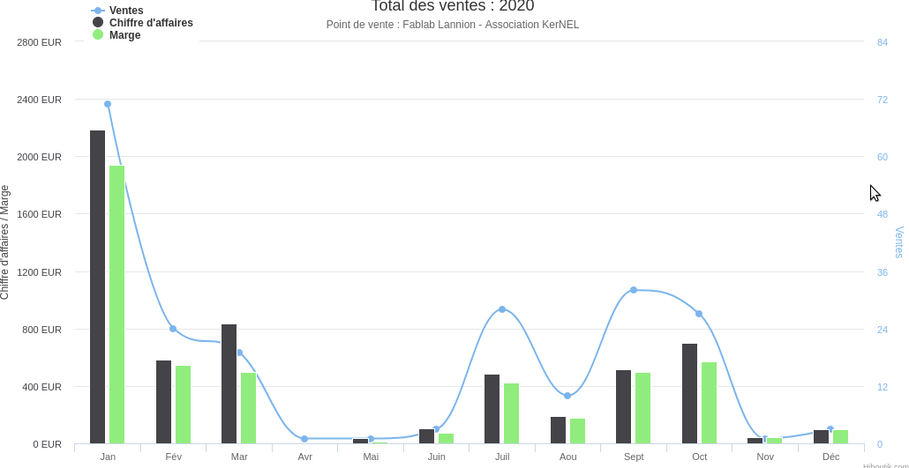
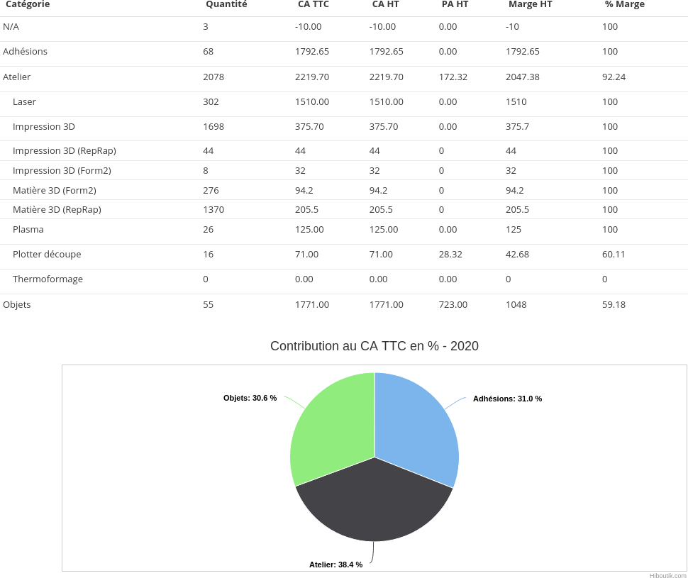
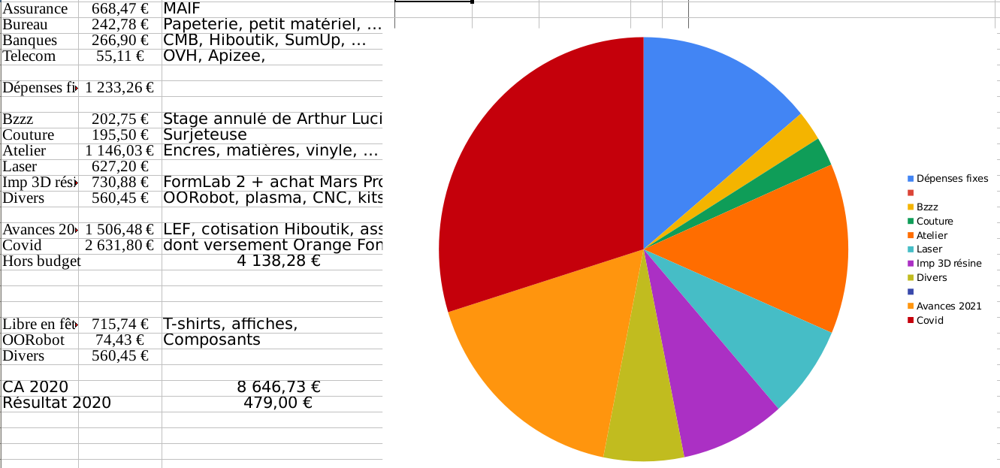

# Bilan financier

____

## Etat des comptes au 01.01.2021

- Crédit Mutuel de Bretagne: 22 975.10
  - Compte Chèque: 3 603 €
  - Livret CMB: 20 105 €
- Paypal: 106.98 €
- Caisse: 60.00 €

**Total: 23 875 €**

____

## Evolution des fonds sur 5 ans:

- 2015: 3 730.97 €
- 2016: 9 660.03 € (+158.91 %)
- 2017: 14 261.00 € (+47.62 %)
- 2018: 15 600,69 € (+08.69 %)
- 2019: 22 882,98 € (+47,62 %)
- 2020: 23 875,03 € (**+992€, +4.33%**)
____

## Investissements:

Peu de gros investissements hors consommables:

- Matériel de couture conventionnel
- Imprimante 3D Elegoo Mars 2 Pro [300€]
  

____

## Chiffre d'affaire 2020 : 8 920.75€

- Total ventes 2020 : 5774 €
- Subvention de la Fondation Orange (Covid): 2 500 €
- Rentrées diverses:  617 € (intérêts Livrets, 200 payé 2019 comptés 2020, remboursements)
____

____

____

## Dépenses 2020: 7 993,64 €

____

____

## Bilan de trésorie

- Dépenses 2020:	7 993,64 €
- CA 2020:        8 920.75€
	
- Résultat 2020:	927,12 €
- Balance de caisse réel:	992,05 €

Delta: + 64,93 € (probablement non intégré au logiciel de caisse)
____

## Déclarations obligatoires

- Déplacements: Morlaix Bernard Arzur pour Tshirt LEF -> 25€
- Heures bénévolat: environ **une personne-an** -> 50 000 €/an.
- Loyer équivalent: 5000€
- **Bilan FabLab “réel” : 8891€ + 50 000€ + 5000€ + ...**
____

## Quelques détails

- Mauvais payeurs : RAS sauf un pro depuis 2017...
- Mauvais fournisseurs : Résine UV via Aliexpress, carte Laser
- Caisse: RAS depuis qu'on met l'excédent de liquide dans le coffre (février)
- Hiboutik: Rentrées en caisse pas toujours effectuées... et interface pas très claire.
____

## Bilan

- Année très spéciale, mais la casse a été limitée.
- Le Fablab a toujours assez de ressources pour renouveller une partie de ses machines sans subvention, ou envisager un apport important pour un gros investissement.
- "Une très bonne année ne veut pas dire qu'elles seront toutes identiques. - David janv. 2020". On en a la preuve

____

# Remarques ou questions ?

____

## Annexe: détails calcul Bénévolat

- Bénévolat a minima:
    - Une réunion CA par semaine: 5 personnes \* 1 heure = 250 h
    - Ouverture mercredi: 2 fm _ 18h à 24h _ 50 = 600 h
    - Ouverture vendredi: 1-2 fm _ 9h à 18h _ 50 = 600 h
    - Expos: 4 fm _ 6 h _ 4 = 100 h
    - Divers (projets, sujets nouveaux, ADIT, visites, etc...) = 100 h
- **une personne-an**, avec un SMIC net 9 € de l'heure coûte au total 12/h € à l’entreprise, sur la durée légale du travail 152 heures par mois -> 22 000€ à 15 €/h, 27€ super brut -> 50 000 €/an
    
