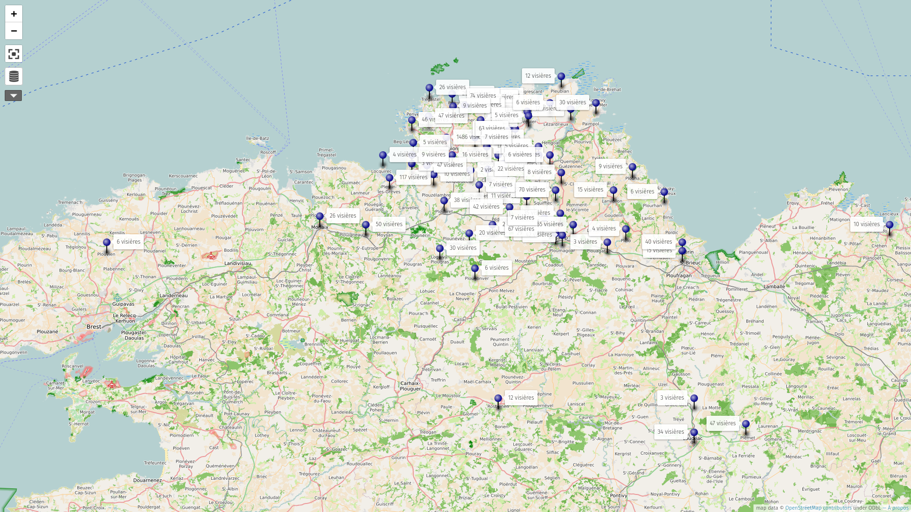
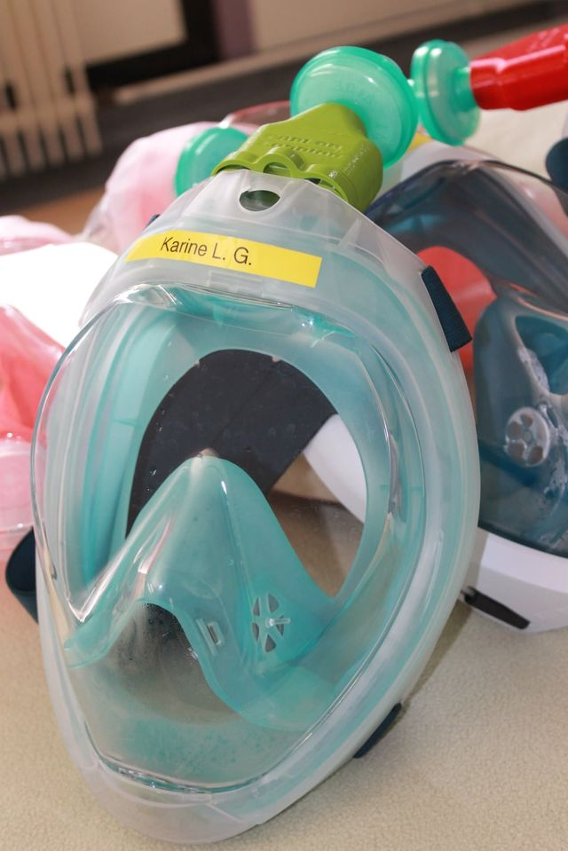
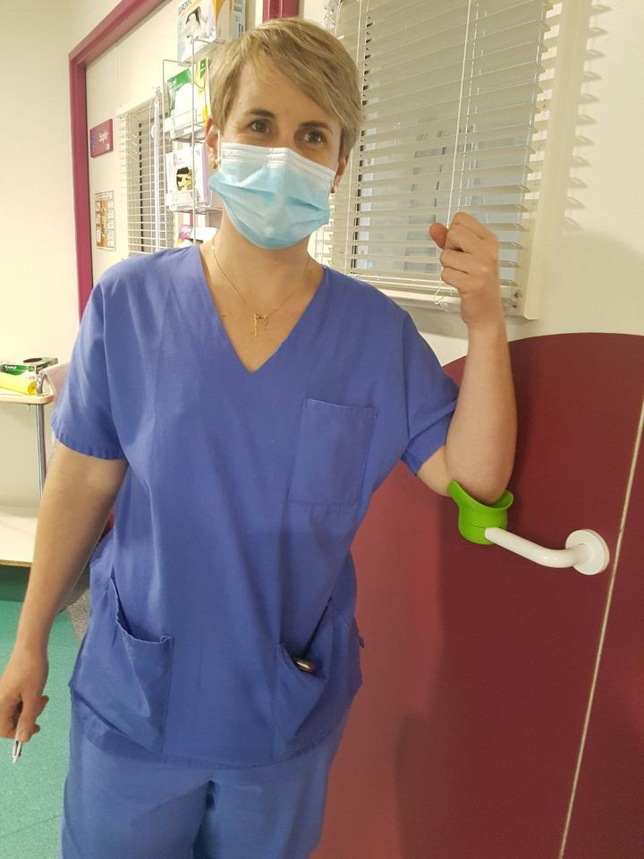
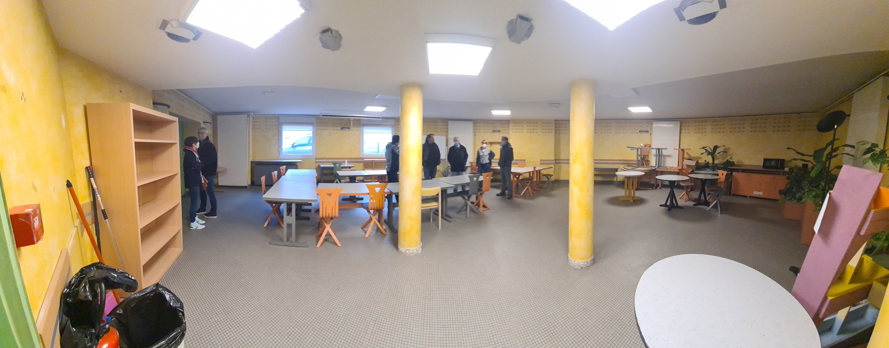
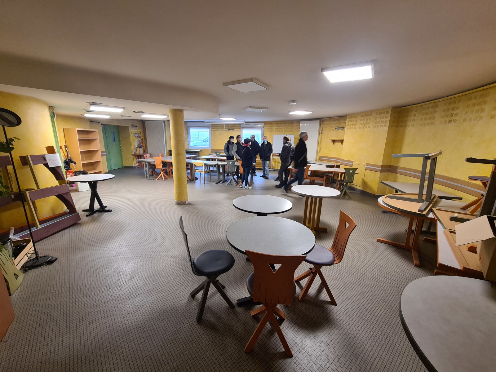
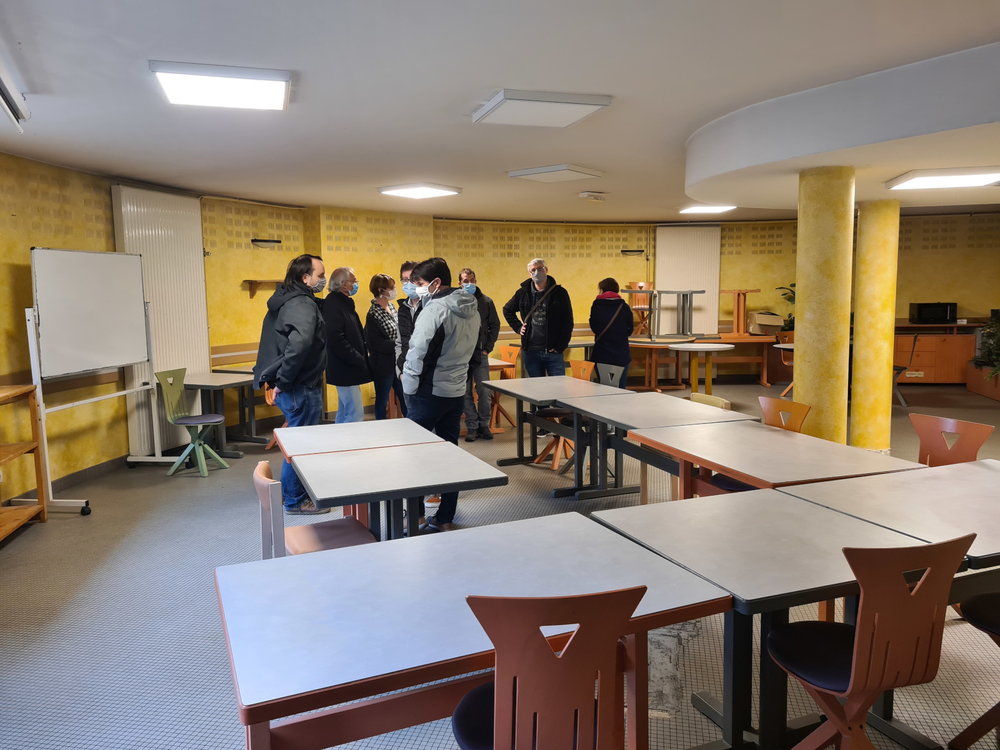

# Bilan moral

____

## Respect des statuts 1/2

- Fablab (référence MIT) : [AAAB](http://wiki.fablab.is/wiki/Fab_Lab_conformity_rating)
  - ouverture à tous 😊
  - charte des fablab 😊
  - participation à la communauté 😊
- Ré-appropriation technique 😊
  - diffusion de matériel
- Ouverture vers les autres fablab et communauté des makers 😊

____

## Respect des statuts 2/2

- 3R: Réduire, Réutiliser, Recycler 😊
  - Vente massive de PC récyclés
- Promotion du logiciel et matériel Libre 😊
  - utilisation quasi-exclusive de logiciels libres
  - documentation ouverte des projets

____

## Objectifs 2020 1/3

### Association

- Nouveau créneau : vendredi matin 😊
- Nouveaux locaux : on va en parler 😐

### Machines

- Atelier tissus
  - brodeuse, surjeteuse 😊
- Imprimante 3D Résine (Elegoo Mars Pro2)

____

## Objectifs 2020 2/3

### Projets

- développement clinostat 😐
- projet collaboratif : 😐

### Événements

- [Libre en Fête 2020](http://libre-en-fete-tregor.fr/) ➔ 29 mars 🥺
- Fête de la science 😊
- Forum des associations 😊
- Portes ouvertes 🥺

____

## Objectifs 2020 3/3

## Communauté

- Compagnons numériques 😊
- Formations 😊
- Projet Maison de l'emploi ? 😐

____

## 2020 Une période en pointillé

Due aux restrictions du covid19:

- Taux d'ouverture du Fablab: 50%
- Baisse de la fréquentation liée en partie aux restrictions

____

## Association

- Locaux "pleins" 😐 jusqu'à mars
- Ouverture à 18h le Mercredi et 9h30-17h30 le Vendredi en fonction des
  possibilités
- Élargissement et diversification des profils et usages du lieu 😊
- Augmentation des interactions avec le territoire 😊
- Newsletter depuis septembre.

____

## Projets / Machines

- Découpeuse [plasma](http://wiki.fablab-lannion.org//index.php?title=Plasma) fonctionnelle et utilisées !
- Imprimante 3D Eleego Mars 2 pro
- Brodeuse numérique à acheter (Merci à la subvention du Département)

____

## Compagnons numériques

- 1 session de formation débutée avec 4 jeunes, 3 ont repris après le 1er confinement. Ils sont allés ensuite jusqu'au bout malgré le contexte.
- Session de Septembre annulée.
- Difficulté pour trouver des jeunes par la mission locale.

____

## Quelques chiffres

- 98 membres (y compris 14 pour 2021) - 107 en 2020.
- 3 asso, 3 entreprises, 13 femmes et 79 hommes
- 76 membres sur 98 l'étaient en 2019, soit environ 1/4 de renouvellement
- Forum : 345 membres et 5104 messages.

____

# Remarques ou questions ?

____

# Makers du Trégor contre le covid19
____

## Makers du Trégor contre le Covid 1/2

- 3 mois où les makers ont montrés leur utilité et réactivité au grand public
- plus de 50 makers dans tous le Trégor
- des visières pour toute la bretagne voir plus.
- des visieres en 3D, mais aussi découpées au laser.
- plus de 4000 visieres et des centaines de masques
- Partenariat avec CoDeHSa, LCV, Anticipa, Fondation Orange...

____

## Makers du Trégor contre le Covid 2/2

Mais aussi:

- un stock d'urgence de PLA financé par CD22
- des productions pour les soignants pour la deuxième vague

**Merci à tous les participants, petits et grands !**

____

____

____

# Déménagement

____

## Déménagement 1/3

- Rappel: Le Lycée souhaite réutiliser les locaux que nous occupons.
- Plusieurs pistes ont été envisagées:
  - LTC: Locaux à coté du futur parc expo
  - Plusieurs locaux privés
  - CROUS
  - La Mairie de Lannion
- De nombreuses réunions et visites !

____

## Déménagement 2/3

- Le déménagement prévu à l'origine au 1er janvier 2021 a été repoussé à l'été 2021, graçe à la mairie, qui s'est engagée à nous reloger !
- 2 pistes sérieuses:
  - Batiment SEGPA de l'ancien Collège
    - Réaménagement temporaire avant l'éco-quartier
    - Donc pour quelques années
  
____

## Déménagement 3/3
- 2ème possibilitée:
    - Mairie + Foyer de jeunes travailleurs
        - Près de 170 m2 en plein centre
        - Aménagement à l'étude par la mairie
        - Loyer de 450€/mois auprès du FJT
        - Dossier à compléter avec la mairie.

____

____

____

____

____

