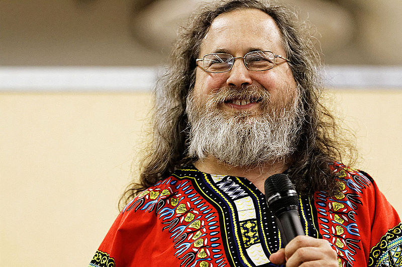
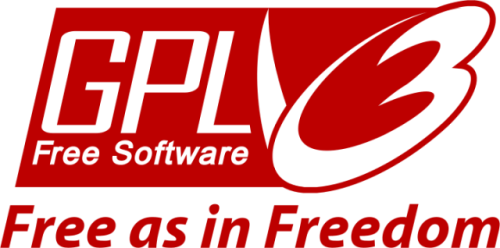

# les libertés

## Executer le logiciel
utiliser, s'en servir

## Étudier le logiciel
apprendre et comprendre

## Modifier le logiciel
contribuer au savoir

## Distribuer le logiciel
dupliquer et diffuser le savoir

> Je peux expliquer le logiciel libre en 3 mots : Liberté, Égalité, Fraternité.
>
> R.M. Stallman

# Une brêve histoire

## Richard Stallman

Note:
Thesupermat CC:BY-SA https://commons.wikimedia.org/wiki/File:Richard_Stallman_-_F%C3%AAte_de_l'Humanit%C3%A9_2014_-_008.jpg

## Linus Torvald

Note:
Krd/Von Sprat CC:BY-SA https://commons.wikimedia.org/wiki/File:LinuxCon_Europe_Linus_Torvalds_03_(cropped).jpg

## Mais aussi
Pamela Jones, Mark Shuttleworth, Bob Young, Jimmy Wales, Lawrence Lessig, Sir Tim Berners-Lee, Blake Ross, Keith Packard, Theo de Raadt, Steve Coast, ...

et **VOUS** ?
Note: Jones(Groklaw), Shuttleworth(canonical), Young(Redhat), Wales(Wikipedia), Lessig(CC), Berners-Lee(http), Ross(firefox), Packard(XOrg), Raadt(OpenBSD), Coast(OSM, Aptonyme :))

# Les licences

## Devoir de réciprocité
GPL, CC:by-sa, AGPL, CeCILL, ...

## Permissive
BSD, MIT, CC:by, Public domain, CeCILL-B, ...

# Perspectives

## LL est partout
basé ou contenant du logiciel libre :
* 80% des navigateurs web
* 85% des smartphones
* 90% des serveurs d'internet

## sur les épaules des géants

## OpenSource vs Logiciel Libre

# Merci

[CC:By-Sa](https://creativecommons.org/licenses/by-sa/2.0/fr/)

